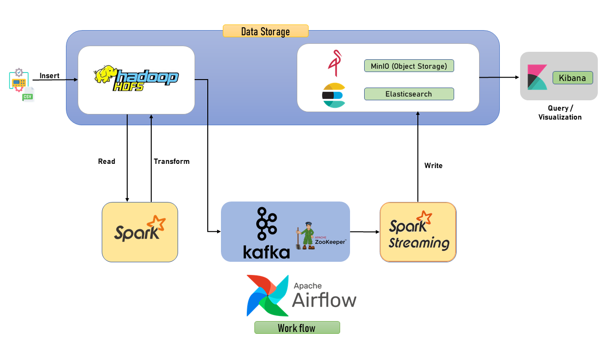
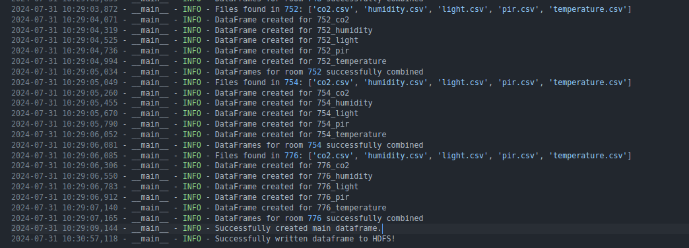
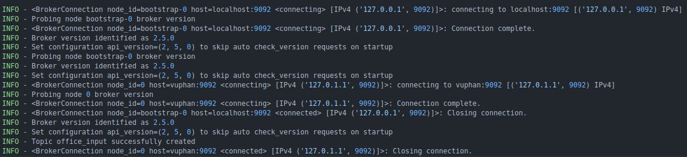

# Stream Data Processing using Hadoop Ecosystem

## Overview

* Fetch compressed data from a URL.
* Utilize PySpark for data processing, leveraging HDFS for storage and monitoring resources via Apache Hadoop YARN.
* Employ a data generator to simulate streaming data and transmit it to Apache Kafka.
* Implement PySpark (Spark Streaming) to consume and process streaming data from Kafka topics.
* Persist streaming data into Elasticsearch for storage and subsequent visualization using Kibana.
* Store streaming data into MinIO, a cloud-native object storage service.
* Utilize Apache Airflow for orchestrating the entire data pipeline workflow.

## System Architecture
<p align = "center">
    
</p>

## Prequisites
Before runing this script, ensure you have the following installed.\
**Note**:  The project was setup on Ubuntu 22.04 OS.

* Ubuntu 22.04 (prefered, but you can use Ubuntu 20.04)
* Apache Hadoop HDFS (installed locally)
* Apache Spark (installed locally)
* Apache Kafka (installed locally)
* Apache Airflow
* Docker
* Minio
* Elasticsearch, Kibana

## Getting Started

1. **Clone the repository**
```
$ git clone https://github.com/VuBacktracking/hdfs-stream-processing.git
$ cd hdfs-stream-processing
```

2. **Start our data streaming infrastructure**
```
$ sudo service docker start
$ sudo systemctl start zookeeper
$ sudo systemctl start kafka
$ start-all.sh
$ docker compose -f storage-docker-compose.yaml up -d
```

3. **Setup environment**
```
$ python3 -m venv .venv
$ pip install -r requirements.txt
```

Create `.env` file and paste your HADOOP_HOME, SPARK_HOME, KAFKA_HOME in it.
```
HADOOP_HOME=""
SPARK_HOME=""
KAFKA_HOME=""
```

4. **Services**

    * Elasticsearch -> `localhost:5601`
    * Airflow -> `localhost:8080`
    * MinIO -> `localhost:9001`
    * Spark Jobs -> `localhost:4040`
    * Kafka -> `localhost:9092`
    * Hadoop Namenode -> `localhost:9870`
    * Hadoop YARN -> `localhost:8088/cluster`
    * Hadoop HDFS -> `localhost:9000`

## Steps of the project

1. **Download data and put to Hadoop HDFS**
```
$ wget -O data/sensors.zip https://github.com/erkansirin78/datasets/raw/master/sensors_instrumented_in_an_office_building_dataset.zip && unzip ./data/sensors.zip -d ./data/ && rm data/KETI/README.txt && rm data/sensors.zip
```

```
$ hdfs dfs -mkdir -p /user/stream_data/
$ hdfs dfs -copyFromLocal ./data/KETI/ /user/stream_data/
```

2. **Run spark transforming**
```
python3 utils/spark_transforming.py
```

<p align = "center">
    
</p>

3. **Create Kafka Topic**
```
python3 kafka/kafka_admin.py
```
<p align = "center">
    
</p>

4. **Running Data Generator**

Thanks for the repository of [@erkansirin78](https://github.com/erkansirin78), this script successfully simulates a streaming data. You can find the scripts of `datatframe_to_kafka.py` in this repository [data_generator](https://github.com/erkansirin78/data-generator).

```
python3 kafka/kafka_producer.py
```

or directly use the bash script
```
./bash/data_generator.sh
```

5. **Read and store data in Minio and Elasticsearch**
```
python3 spark_streaming/covert-to-elasticsearch.py
```

and

```
python3 spark_streaming/covert-to-minio.py
```

## Read data in Elasticsearch